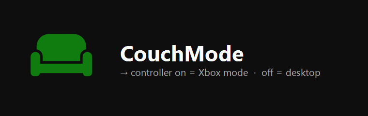

# AutoXboxMode

**Automatically enable Windows 11 Xbox mode (the full screen experience) when an Xbox controller connects, and turn it off when the controller disconnects.**



AutoXboxMode is a tiny system tray utility for Windows 11. The new
**Xbox full screen experience (FSE)** turns your PC into a console-like, big-screen
gaming interface. AutoXboxMode makes it automatic: power on your Xbox controller and
your PC enters Xbox mode; turn the controller off and it returns to the desktop.

No more reaching for the mouse. Let the controller drive the experience.

---

## Features

- **Hands-free switching:** enters/exits Xbox mode based on controller power state.
- **Reliable detection:** uses the official `Win+F11` toggle and detects the current
  mode by checking whether the Xbox window fully covers its monitor. Works on any
  resolution and multi-monitor setup; no fragile mouse coordinates.
- **Controller detection via XInput:** works with any Xbox / XInput-compatible
  controller (wired, wireless dongle, or Bluetooth), regardless of brand. No admin rights required.
- **Event-driven, zero idle CPU:** listens for Windows device notifications instead
  of polling, so it does nothing until a controller connects or disconnects.
- **System tray app:** lightweight, runs quietly in the background (~30 MB RAM).
- **Configurable:** toggle each behavior and start with Windows.
- **Tiny & dependency-free:** a single small executable built on .NET Framework 4.8,
  which ships with Windows 11. Nothing else to install.

## Requirements

- Windows 11 with the **Xbox full screen experience** available
  (Settings → Gaming → Full screen experience). See Microsoft's overview:
  [Windows gaming full screen experience](https://support.microsoft.com/en-gb/topic/windows-gaming-full-screen-experience-67fb8d12-5467-4a95-8adf-0a10789576ab).
- An Xbox / XInput-compatible controller.

> **Don't see the feature yet?** It's rolling out gradually (May 2026 update and
> later), so not every PC has it. If yours doesn't show it, community guides
> explain how to enable it early, e.g.
> [How to force-enable Xbox mode in Windows 11](https://www.windowslatest.com/2026/05/02/how-to-force-enable-xbox-mode-in-windows-11-and-why-microsoft-hides-it-explained/).
> Enabling hidden features is at your own risk.

## Installation

1. Download `AutoXboxMode.exe` from the [latest release](../../releases/latest).
2. Run it. An icon appears in the system tray.
3. (Optional) Open **Settings…** from the tray menu and enable **Start automatically with Windows**.

> The app is unsigned, so Windows SmartScreen may warn on first run.
> Click **More info → Run anyway**.

## Usage

Once running, AutoXboxMode works automatically:

| Action | Result |
| --- | --- |
| Turn the controller **on** | PC enters Xbox mode (full screen experience) |
| Turn the controller **off** | PC returns to the desktop |

Right-click the tray icon for options:

- **Active:** pause/resume the automation.
- **Settings…** configure behavior (see below).
- **Open Log File:** view the activity log.
- **About…** version and project link.
- **Exit:** quit the app.

### Settings

| Option | Default | Description |
| --- | --- | --- |
| Enter Xbox mode when a controller connects | On | Switch to Xbox mode on controller power-on. |
| Exit Xbox mode when all controllers disconnect | On | Return to desktop when the last controller powers off. |
| Start automatically with Windows | Off | Launch AutoXboxMode at sign-in. |
| Debug logging | Off | Write a verbose activity log for troubleshooting. |

Settings and logs are stored in `%AppData%\AutoXboxMode\`.

## Screenshots


## How it works

- **Controller events** are delivered by Windows: a message-only window registers for
  device-interface notifications (`RegisterDeviceNotification` + `WM_DEVICECHANGE`), so
  there is no background polling. Connected controllers are then counted with XInput
  (`XInputGetState`).
- **Mode switching** sends the official **`Win+F11`** shortcut that Windows 11 uses to
  toggle the full screen experience.
- **Current mode** is detected by enumerating top-level windows: if a visible window
  whose title contains "Xbox" fully covers the monitor it sits on, Xbox mode is on.
  Because this is evaluated relative to each monitor's bounds, it is independent of
  resolution and works with multiple monitors.

## Building from source

Requires the .NET Framework 4.x compiler (`csc.exe`), which is present on every
Windows 11 machine.

```powershell
.\build.ps1
# -> build\AutoXboxMode.exe
```

## Privacy & security

- **Fully offline.** AutoXboxMode makes no network connections: no telemetry,
  no analytics, no data collection of any kind.
- **No admin rights.** It only writes its own startup entry under
  `HKCU\…\Run` (when you enable *Start with Windows*) and its config/log under
  `%AppData%\AutoXboxMode\`.
- **Open source.** You can read every line, or build the executable yourself
  with `build.ps1`.
- **Unsigned binary.** The released `.exe` is not code-signed, so SmartScreen may
  warn on first run. A few heuristic / machine-learning antivirus engines may
  flag it as a false positive because it simulates the `Win+F11` keypress and
  starts with Windows; mainstream scanners (including Microsoft Defender) report
  it clean. You can verify your download against the SHA-256 published in each
  [release](../../releases), scan it on [VirusTotal](https://www.virustotal.com/),
  or build it yourself from source.

## Roadmap

- Choose apps/shortcuts to **close** when a controller connects (e.g. quit work apps).
- Define custom **actions** to run when a controller disconnects.
- Per-controller and per-profile rules.

## Support

AutoXboxMode is free and open source. If it makes your gaming setup nicer, you can
support development:

- [GitHub Sponsors](https://github.com/sponsors/EzerchE)

## Disclaimer

AutoXboxMode is provided **"as is", without warranty of any kind**. It only sends
the standard `Win+F11` shortcut and toggles its own startup entry, and it does not
modify system files. That said, you use it at your own risk: the author is not
liable for any damage, data loss, or other issues arising from its use (see the
[MIT License](LICENSE) for the full terms).

## Acknowledgments

Code signing for Windows release builds is provided free of charge by the
[SignPath Foundation](https://signpath.org/) open-source program.

## License

[MIT](LICENSE)

---

*Not affiliated with or endorsed by Microsoft. "Xbox" and "Windows" are trademarks of
Microsoft Corporation.*
